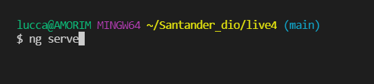
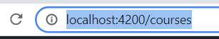
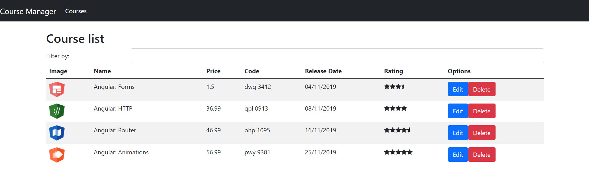

# Projeto-Dio-Live :four: :rocket:

#### Início

Fala pessoal, comecei minha trilha de aprendizado em Angular, o objetivo aqui é montar uma página de cursos de programação.

Obrigado DIO por disponibilizar este conteúdo!  :smile:

#### Pré-requisitos

Você precisa ter instalado 

* Node.js
* Angular CLI
* Alguma IDE de sua escolha

#### Instruções:

1. Baixe os arquivos deste repositório

2. Execute o comando `ng serve` em seu terminal dentro do diretório deste projeto

</img>

3. Digite `http://localhost:4200/courses`  no seu navegador.

</img>

4. Baixe os arquivos de backend do seguinte repositório: https://github.com/Amorim-cyber/Projeto-Dio-Live4-server e siga as instruções contidas dentro dele. **O projeto não irá iniciar de forma correta se você pular este passo**.
5. É crucial que os dois serviços(backend e angular) estejam online.

#### PRONTO

A aplicação está pronta para uso.

</img>

#### Trilha de aprendizado:

Coloquei aqui algumas notas sobre o que eu aprendi com este projeto

   
<strong>Primeiro COMMIT -> Primeiros passos para desenvolver com angular
	</strong>

    <ol>
        <li>Instalação do ambiente.</li>
        <li>Aprendi o que é interpolação, data binding ngModel(one way/visualizar[], two way/visualizar e alterar[()]).</li>
        <li>Criando os primeiros componenentes (course-list/ course), instalando e importando o bootstrap no projeto, criação de classes no typescript e como importa-las. Aprendi o uso do recurso ngFor nos arquivos HTML.</li>
        <li>Criando um componente dentro de outro componente (star), uso dos arquivos assets, instalando e importando o font-awesome no projeto. Aprendi sobre @Input que recebe valores externos, e com eles, alterar as características dos componentes.</li>
    </ol>
     

   
<strong>Segundo COMMIT -> Lidando com vários componentes
	</strong>

    <ol>
        <li>Aprendendo o que é uma injeção de dependência. Criamos o arquivo course.service.ts para ser responsável por retornar a lista de cursos.</li>
        <li>Aprendendo mais sobre os recursos do data binding, uso do _ na frente do atributo apenas quando ele for privado. Foi criado uma barra de busca de cursos.</li>
        <li>Foi ensinado pipes, uma forma de mudar atributos da página. Podemos utilizar pipes nativos do angular ou criar pipes customizados.</li>
        <li>Rotas, navegação entre componentes do site. Componentes passam a ser paths/rota ao invés de tags. Novos componentes criados.</li>
        <li>Adicionando novas rotas ao projeto utilizando o routerlink.</li>
        <li>Trabalhando com templates de formulários para edição dos dados dos cursos.</li>
    </ol>
     

   
<strong>Terceiro COMMIT -> Segregando responsabilidades
	</strong>

    <ol>
        <li>Integrando o backend ao projeto, importando o modulo HTTP, alterando as funcionalidades para servir ao server backend. Alteramos os metodos GET e POST do site.</li>
        <li>Incluindo o metodo DELETE ao projeto</li>
        <li>Separando o projeto em modulos, um componente não pode ser declarado em dois modulos diretamente. Aprendi sobre o modulo CommonsModule. Descentralização do app.module e criação do course.module.</li>
        <li>Aprendi o conceito de shared module. Shared module reuni pequenos componentes que podem ser reutilizados por outros componentes. O CommonModule é um shared module nativo por exemplo.</li>
        <li>Aprendi o conceito de core. Ele reuni os maiores componentes do site que não podem ser reutilizados, a regra de negócio.</li>
        <li>Tratando erros, colocando o component Error para dentro do modulo Core.</li>
    </ol>
     

FIM DA TRILHA

#### Forte abraço :smile:

